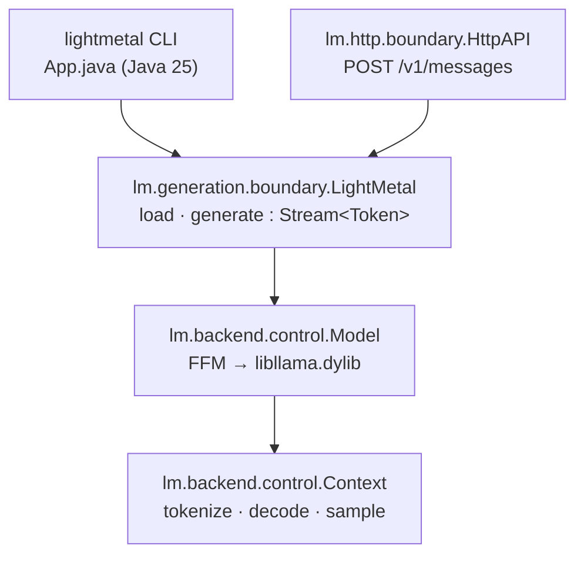

# lightmetal

GPU LLM inference on Apple Silicon from a single Java 25 executable JAR with
zero dependencies. Binds a Metal-enabled `libllama.dylib` through the Foreign
Function & Memory API. Runs Mistral-architecture GGUF models such as Mistral
Medium 3.5.

## Prerequisites

- Java 25+
- [`zb`](https://github.com/AdamBien/zb) on PATH
- `brew install llama.cpp` (provides a Metal-enabled `libllama.dylib`)
- `jextract` on PATH — only to regenerate FFM bindings; pre-generated bindings
  are committed.

## Build and Run

```
zb build
java --enable-native-access=ALL-UNNAMED -jar zbo/lightmetal.jar \
     -model ~/models/Mistral-Medium-3.5-128B-UD-Q5_K_XL-00001-of-00003.gguf \
     -prompt "Refactor this Java method:"
```

Options: `-max-tokens`, `-temperature`, `-top-p`, `-top-k`, `-min-p`, `-seed`,
`-serve`, `-port`, `-help`.

With every parameter set in `~/.lightmetal/app.properties`:

```properties
model=/Users/duke/Downloads/Mistral-Medium-3.5-128B-UD-Q5_K_XL-00001-of-00003.gguf
max-tokens=256
temperature=0.7
top-p=0.9
top-k=40
min-p=0.05
context.length=32768
context.batch.size=2048
```

the invocation collapses to just the prompt (CLI flags still override any
property):

```
java --enable-native-access=ALL-UNNAMED -jar zbo/lightmetal.jar \
     -prompt "What is Java?"
```

## HTTP API

`-serve` starts an Anthropic-compatible `POST /v1/messages` endpoint instead of
running a one-shot generation. The model loads once; requests are serialized
because llama.cpp contexts are not thread-safe.

```
java --enable-native-access=ALL-UNNAMED -jar zbo/lightmetal.jar \
     -model ~/models/Mistral-Medium-3.5-128B-UD-Q5_K_XL-00001-of-00003.gguf \
     -serve -port 8080
```

```
curl -s http://localhost:8080/v1/messages \
  -H 'content-type: application/json' \
  -d '{"max_tokens":64,"system":"be terse","messages":[{"role":"user","content":"say hi"}],"temperature":0.7}'
```

Request fields honored: `system`, `messages` (`content` as string or
`[{"type":"text","text":"…"}]` blocks), `max_tokens`, `temperature`. `tools`,
`thinking`, `output_config`, and `model` are accepted and ignored — the loaded
GGUF wins. Response shape matches Anthropic's `{id, content[…], stop_reason,
usage}` so existing clients (e.g. [zsmith](https://github.com/AdamBien/zsmith))
only need a base URL switch.

### OpenAI-compatible endpoints

For tools that speak the OpenAI Chat Completions protocol (Continue, Aider,
Open WebUI, LangChain defaults, etc.), the same server also exposes
`POST /v1/chat/completions` and `GET /v1/models`. The `model` field is
accepted and ignored — the loaded GGUF wins, exactly as with `/v1/messages`.

```
curl -s http://localhost:8080/v1/chat/completions \
  -H 'content-type: application/json' \
  -d '{"model":"lightmetal","messages":[{"role":"user","content":"say hi"}],"max_tokens":64}'
```

Streaming (`stream: true`) is not yet supported and returns HTTP 400.
`tools` are mapped onto the existing Mistral tool pipeline and surface
in the response as standard OpenAI `tool_calls`.

## Architecture



## Configuration

`libllama.dylib` discovery falls back to `brew --prefix llama.cpp`; override
with the `LIGHTMETAL_LIB` environment variable.

KV cache and batching are tunable via `app.properties`:

| Property | Default | Effect |
|---|---|---|
| `context.length` | 32768 | KV cache size in tokens. Memory scales linearly. |
| `context.batch.size` | 2048 | `n_ubatch` — physical decode chunk size. |
| `context.gpu.layers` | -1 | Layers offloaded to Metal; `-1` = all. |
| `context.seed` | 0 | Context seed. |
